# Range Minimum Query

The *range minimum query* (RMQ) operation is rather simple but has multiple applications in various algorithms and data structures, e.g., for finding the lowest common ancstor of two nodes in a tree or for simulating top-down suffix tree traversals in a suffix array. The operation is this: give an array $x$ and two indices $i < j$, find the index of the minimal value in $x[i:j]$: if $k = \mathrm{RMQ}(x, i, j)$ then $x[k] \leq x[h]$ for $i \leq h < j$. By this definition, which is the traditional, you get an arbitrary minimal index if there are multiples of them, but it is useful to know which one you get, so we will require that it is the *left-most* minimal value: If $k = RMQ(x, i, j)$ then $x[k] < x[h]$ for $i \leq h < k$ and $x[k] \leq x[h]$ for $k \leq h j$.

Efficient range minimum queries are important in multiple applications, but learning how to make this query efficient is interesting in its own right. Some of the techniques--those I will describe here--are also applicable in other contexts, so they are nice to know, even if you never end up needing RMQ. Some of the tricks you already know, like dynamic programming, but some of them might be new.

As with many data structures, we have two phases were we spend time. A *preprocessing* phase, to get our data in order, and then a *query* phase, where we use the preprocessed data to do queries. I will use the notation $\langle O(p),O(q) \rangle$ notation to describe an approach, where $p$ denotes the preprocessing time and $q$ the time needed for one query.

I have coded the ideas in Rust here and that is all you get. My idea is that you would implement them in a language of your choice. Since that is not likely to be Rust, Rust seemed like a good idea for showing you the ideas without affecting how you choose to implement them yourself. I'll explain when there is Rust weirdness, but for most of the code it should be easy enough to read.

Let's get started.

## The "just scan" solution

You don't have to do any preprocessing to solve this problem. If we don't preprocess, the time it takes to do that is naturally `O(1)`.

What about the query, then? We would have to scan through `x[i:j]` to find a minimal value and pick the first of those. Here is how I have implemented that idea:

```rust
fn rmq(x: &[usize], i: usize, j: usize) -> Option<usize> {
    let y = &x[i..j];
    let min_val = y.iter().min()?;
    let pos = i + y.iter().position(|a| a == min_val)?;
    Some(pos)
}
```

The `usize` type is an unsigned integer. There are multipel of those, but this is the one you use for indexing and such, so it is the one we must use for index variable `i` and `j` and for the result of a range minimum query (which, as you recall, is an index). Well, it isn't an index here, but I will get to that in a second.

The function gets the relevant slice out of `x`. The `i..j` expression works as `i:j` in Python and the `&` in front of `x` means that we get a reference to this slice of `x`. We don't copy any elements from `x` here, we just get a way of treating a sub-sequence as an object. It isn't important here, because we are going to scan through all of `y` anyway, but remember that in Python, `x[i:j]` is *copying* all the elements in the slice, so it takes time $O(j-i)$. This isn't the case in all languages; some allow you to slice in $O(1)$ because you operate on the same data and not a copy.

Anyway, we get `y`, then we get the smallest value in `y` (the `.iter()` lets us run through `y` and the `.min()` gives us the minimal value) and finally we get the first position that satisfy the predicate `a == min_val`, so the first (left-most) index where we have a minimal value.

We then return `Some(pos)` and what that means is relevant for when I said that we don't actually return an index.  The `Option` type wraps that we might have a value or we might have `None`. All python types can also be `None`, but Rust forces us to be explicit about when we might have `None` or when we might have an object.

A range minimum query should always return an integer, but... there are cases where you can't. If some smuck calls `rmq(x, i, j)` with an empty interval (`i == j`) there *is* no minimal value and no index to return. You either have to handle this by raising an exception, crashing the program, or returning some indication that you can't produce valid output.

All options are fine here, I think, but later I will use this method in a case where I might have empty intervals. There, I have to either check for an empty interval up front, or handle that this function gives me `None`, and I found it to be easier to handle `None`, so this is what my code looks like.

The `?` after `min()` and `position(...)` is related to this `Some(...)`/`None` issue. The question mark will return immidiately if the expression to the left of it evaluates to `None`. If I call `min()` on an empty interval, then I get `None` back, and because of the `?` I immidiately return that. I didn't have to use `?` after `position()` because I know that if I get there I will also get a value--`Some(...)` value, actually--but I need to get the actual value out of the `Some(...)` construction, and `?` does that.

If `.position()` gives me `Some(k)`, then `k` is an index into `y`, but I want an index into `x`, so I add `i` to it. I then return the result. Since my function returns an `Option<usize>` it needs to return either `None` or `Some(val)`, so I wrap the result in a `Some(...)`.

That is how the function works, and it takes time $O(j-i)$ which I will simplify to $O(n)$. 

So, with no preprocessing and a linear scan for each query, we have a solution that runs in $\langle O(1),O(n) \rangle$.

## Tabulating all intervals

You can of course also go to the other extreme and build a table of all interval $i < j$ so when you need to query an interval you just look up the result in a table. I have put an implementation of that in `rmq/src/tabulate.rs`.

The preprocessed data structure consists of a table and nothing more.

```rust
pub struct TabulatedQuery {
    tbl: triag::UTTable,
}
```

The `triag::UTTable` type is a structure I have implemented to handle upper triangular matrices. I store solutions for intervals $i < j$ only, so I don't need to store any $j \leq i$ and I don't want to use $n \times n$ space if I can get what I need with half that. It works like a table the same way you would expect (and you can check the source in `rmq/src/tables.rs`).

The query is the simplest here:

```rust
impl RMQ for TabulatedQuery {
    fn rmq(&self, i: usize, j: usize) -> Option<usize> {
        if i < j { Some(self.tbl[(i,j)]) } else { None }
    }
}
```

If the interval is valid, i.e., $i < j$, then I get the value from the table and return `Some(...)` that. Otherwise, I return `None`.

For the preprocessing, we have to be careful. The immidiate throught might be to use the function from above for each interval.

```rust
  tbl[(i,j)] = super::rmq(x, i, j);
```

(where `super::rmq` is the function from earlier and not the query method we just wrote).

However, this query takes time $O(n)$ so if we do it for all intervals the total preprocessing time is $O(n^3)$. We can do a little better.

Using dynamic programming we can build the table of intervals in order of increasing length. If you want to know the RMQ of `x[i:j]` then you already know the result for `x[i:j-1]` (because it is shorter), so you can compute the result for each interval in constant time, giving us a total preprocessing time of $O(n^2)$--and since we have to tabulate quadratically many intervals that is as good as it gets.

```rust
impl TabulatedQuery {
    pub fn new(x: &[usize]) -> Self {
        let mut tbl = triag::UTTable::new(x.len());
        for i in 0..x.len() {
            tbl[(i, i + 1)] = i;
        }
        for i in 0..x.len() - 1 {
            for j in i + 2..x.len() + 1 {
                // Dynamic programming:
                // Min val in [i,j) is either min in [i,j-1) or [j-1,j)
                let left = Point::new(tbl[(i, j - 1)], &x);
                let current = Point::new(j - 1, &x);
                tbl[(i, j)] = cmp::min(left, current).0
            }
        }
        TabulatedQuery { tbl }
    }
}
```

That gave us a solution with running time $\langle O(n^2),O(1) \rangle$. Great if you have time to tabulate and plan to do lots and lots of queries, but a quadratic preprocessing time is prohibitive for genome-scale sequences...

## Using a sparse table

There is a really neat trick when you need to tabulate intervals. It doesn't always work, but it works surprisingly often. The trick is to not tabulate all the intervals. Presto, you don't have to spend at least quadratic time any more.

Of course, we don't want to go back to *no* table again, there queries were too expensive, but there is a trick that gives us constant time queries with only $O(n \log n)$ preprocessing time.[^1]

What we will do is this: we tabulate `tbl[i,k] = rmq(x, i, i+2**k)` for all `i` and all powers of two `2**k <= n`. There are only $\log n$ such powers of two, so the table only has have $O(n \log n)$ entries, and if we can compute an entry in constant time we have $O(n \log n)$ preprocessing. The trick for that is once again dynamic programming. If you want to know $\mathrm{RMQ}(i,i+2^k)$ you will already have computed $\mathrm{RMQ}(i,i+2^{k-1})$ and $\mathrm{RMQ}(i+2^{k-1},i+2^k)$, so you just have to get the values there and pick the best.

Before I show you the code, though, I need to show you a few additional tricks. Some of Rust specific--but you can achieve similar things in other languages--and others are just general ways of moving complexity from one place to another and making your code simpler in the process.

First the technical stuff. Rust makes it rather easy to define your own integer types (amonst others) by wrapping an integer type. You can do this in other languages as well, but it is easy to do here, there is no runtime overhead because the compiler throws it away again, and it can help you keep finer track of types.

I need a table where keys are index and powers of two, and I *don't* want to mix those up. If I have functions that simply takes two integers as arguments, I might very easily mix them up--I think I might even have done that once or twice. So if two integers have different roles, I think they should have different types, and therefore I defined a new type for powers.

```rust
pub struct Pow(pub usize);
impl Pow {
    /// for a power Pow(k) get 2^k.
    #[inline]
    pub fn value(&self) -> usize {
        1 << self.0
    }
}
```

There is more to them, but you can look at the source for that. They are just wrappers for powers of two that I can use in my table. I have also defined a new type for this kind of tables--it is not quite the same as the one we used before--and it is the `powers::Powers` type you will see below. You don't need to see the details of the implementation as it is hardly more than a wrapper.

If I have an array of length $n$ I need a table that can handle $n$ indices and $\log_2(n)+1$ powers (where $\log_2(n)$ is rounded down). You might think it should be $\log_2(n)$ rounded up, but no, and it has to do with how the `powers::Powers` table works and that we actually index 1-based on the log-scale. You might use a different solution and then not have to deal with that, but it took me a few tries to get right so I thought I might mention it.

```rust
pub fn log_table_size(n: usize) -> Pow {
    let Pow(k) = log2_down(n);
    Pow(k + 1)
}
```

Wrapping base types with different roles is very useful if you use a language that is statically typed and where this doesn't incur a runtime penalty, so I generally do it. If you do it in Python you will pay a runtime cost, so you might not want to there.

Then the other idea, and it might be a stretch to call it an idea at this point, but it becomes helful later. When we have to determine which of $(i,i+2^{k-1})$ and $(i+2^{k-1},i+2^k)$ has the smaller value, we can use `RMQ` to get the index, then we need to pick the values in `x` at those index, find the minimal of those, and then pick the index corresponding to those values...oh my.

I decided it would be easier to have a type that holds an index together with value, `(i,x[i])`, and define `min` on those.

```rust
pub struct Point(usize, usize);
impl Point {
    #[inline]
    pub fn new(i: usize, x: &[usize]) -> Point {
        Point(i, x[i])
    }
    /// Get Some(Point(i,x[i])) if the index is valid or None if not
    #[inline]
    pub fn get(i: Option<usize>, x: &[usize]) -> Option<Point> {
        Some(Point(i?, *x.get(i?)?))
    }
}
```

It is just a wrapper again, but if I call `Point::new(i, x)` I get the index together with the value and I have defined (not shown here) a comparison so I can get the `min` of two `Point`s.

The `get()` method is another trick that we will need later, but if I have an index, that might be `None`, and I want the corresponding value, which doesn't exist if `i` is outside of the range of `x`, then `get` will give me `Some((i,x[i]))` if that is valid and `None` otherwise. We don't need it now, but you will see its use later.

If you want the underlying values in a `Point`, `p.0` will give you the first (`i`) and `p.1` will give you the second (`x[i]`).

Ok, I think that was all we needed to implement the preprocessing for this new, sparse, table representation:

```rust
/// RMQ table that tabulates all [i,i+2^k] ranges (there are O(n log n)),
/// form which we can get the RMQ from the table by splitting [i,j) into
/// two, [i,2^k) and [j-2^k,j) (where k is the largest such k). We can get
/// the RMQ from those two intervals with a table lookup in O(1) and then
/// pick the one of those with the smallest value.
/// The result is O(n log n) preprocessing and O(1) lookup.
pub struct Sparse<'a> {
    x: &'a [usize],
    tbl: powers::Powers,
}

impl<'a> Sparse<'a> {
    pub fn new(x: &'a [usize]) -> Self {
        let n = x.len();
        let mut tbl = powers::Powers::new(n);

        // When tbl is a TwoD table, interpret tbl[i,Pow(k)] as containing
        // values (at powers of two) in the range [i,i+2^k).
        let Pow(logn) = powers::log_table_size(n);

        // Base case: intervals [i,i+1) = [i,i+2^0).
        for i in 0..n {
            tbl[(i, Pow(0))] = i;
        }

        // Dynamic programming construction of tables of increasing length.
        // We have O(log n) runs of the outer loop and O(n) of the inner,
        // so the total time is O(n log n).
        for k in 1..logn {
            for i in 0..(n - Pow(k - 1).value()) {
                // Interval [i,i+2^k) = [i,i+2^{k-1}) [i+2^{k-1},(i+2^{k-1})+2^{k-1})
                let left = Point::new(tbl[(i, Pow(k - 1))], &x);
                let right = Point::new(tbl[(i + Pow(k - 1).value(), Pow(k - 1))], &x);
                tbl[(i, Pow(k))] = cmp::min(left, right).0;
            }
        }

        Sparse{ x, tbl }
    }
}
```

As we already discussed, there are $O(n \log n)$ table entires, we compute each of them with dynamic programming in $O(1)$, so the preprocessing time is $O(n \log n)$.

What about the queries? We don't have all intervals in our table, so $\mathrm{RMQ}(x,i,j)$ isn't a simple table lookup any longer.

What we do is this: we find the largest power of two, $2^k$ such that $i+2^k < j$. If this is the largest such power, then the intervals $[i,i+2^k)$ and $[j-2^k,j)$ cover $[i,j)$, meaning that there isn't any indices in $[i,j)$ that aren't in at least one of the two--but there might be some overlap between the two intervals.

Well, overlaps don't really bother us when we want a minimal value; the worst that can happen is that we get the right answer twice.

If you want the smallest value in $[i,j)$, get the smallest from the two intervals that are powers of two--look them up in the table--and pick the smallest of them.

```rust
impl<'a> RMQ for Sparse<'a> {
    fn rmq(&self, i: usize, j: usize) -> Option<usize> {
        if i < j {
            let (idx_i, idx_j) = powers::power_index(i, j);
            let pi = Point::new(self.tbl[idx_i], &self.x);
            let pj = Point::new(self.tbl[idx_j], &self.x);
            Some(cmp::min(pi, pj).0)
        } else {
            None
        }
    }
}
```

where

```rust
/// From range [i,j), get values (k,j-2^k) where k is the offset
/// into the TwoD table to look up the value for [i,i+2^k) and [j-2^k,j)
/// from which we can get the RMQ.
pub fn power_index(i: usize, j: usize) -> ((usize,Pow), (usize,Pow)) {
   let powk = log2_down(j - i);
   ( (i, powk), (j - powk.value(), powk) )
}
```

This is two table lookups and some comparisons, all in $O(1)$, so this sparse idea gives us $\langle O(n \log n),O(1) \rangle$.

## Reduce + sparse

Well, that's all good and fine, but who wants to spend time $O(n \log n)$ on preprocessing? Can't we do better?

Sure we can!

And here we get to another trick that pops up from time to time, and is more general than what we see here. If you have something that takes $O(f(n))$ and you want it to be faster, make $n$ smaller!

Yeah, it sounds stupid when I say it like that, but this is the idea. We reduce our data into something smaller, say of length $m$, and now $O(f(m))$ might not be so bad.

We have a preprocessing time of $O(n \log n)$, and if we reduce it, then it becomes $O(m \log m)$. If, for example, we split $x$ into blocks of size $b$ and treat each block as a value, then $m = n/b$ of if $b > \log(n/b)$ then $O(n/b \log(n/b))$ is in $O(n)$. You could use $b = \sqrt{n}$ or $b = \log n$ here, or basically anything where the block size is larger than $\log(n/b)$ and you will get a linear preprocessing time.

The way you reduce `x` into blocks is pretty simple as well. Split `x` into blocks, then pick the minimal value for each block, and save the index of the minimal value in each block so you can go back from the reduced data to the original indices.

You will get something like this

```
 x       =  [3, 1, 6] [4, 7, 9] [1, 3, 5] [2, 5, 2]
 values  =  [   1      4         1         2      ]
 indices =  [   1      3         6         9      ]
```

if `x` is what it is there and the block size is 3. For each block we know the smallest value and the index (in `x`) where it appears.

It is reasonably easy to implement the reduction:

```rust
fn reduce_array(x: &[usize], block_size: BlockSize) -> (Vec<usize>, Vec<usize>) {
    let BlockSize(bs) = block_size;
    let mut indices: Vec<usize> = Vec::new();
    let mut values: Vec<usize> = Vec::new();
    let no_blocks = x.len() / bs;
    for block in 0..no_blocks {
        let begin = block * bs;
        let end = begin + bs;
        let Point(pos, val) = 
            Point::new(super::rmq(&x, begin, end).unwrap(), &x);
        indices.push(pos);
        values.push(val);
    }
    (indices, values)
}
```

Here, the `BlockSize` type is another wrapper around integers. Just think integers, but with a type that means I won't confuse it with some other kind of integer. The `let BlockSize(bs) = block_size` assignment gives me the underlying integer and puts it in `bs` so I can work with it as a simple integer.

I use `super::rmq(&x, begin, end)`--the first function we saw that does RMQ by scanning through the range--to get the smallest index out of a block. Then I use `Point::new(i,x)` to get the point `(i,x[i])` and the assignment `let Point(pos, val) = ...` puts the position in `pos` and the value in `val`. You can probably guess what the two `.push()` statements are doing.

Ok, so now I have reduced data with the minimal value and index for each block. Then what?

Well, we planned to use the sparse matrix trick on the reduced data, so that is what we will do. That will let us query `RMQ(values, bi, bj)` on the reduced data with indices mapped to the smaller data (just divide $i$ and $j$ with the block size to get there). As long as we only want to know RMQ queries at the break points of blocks, that will get us there.

But users are unreasonable and will probably make queries that do not fall on the block break points, so we need to handle that as well.

Let's say that we want to query `RMQ(x, i=2, j=10)` (so get the index of the smallest value in `x[2:10]`). Neither `i` or `j` are on block boundaries, so we cannot query directly. But there is a stretch between them that we *could* query in the reduced data, the bit from the first block that starts after `i` and to the last block that ends before `j`. 

```
                  i=2                        j=10
 x       =  [3, 1, 6] [4, 7, 9] [1, 3, 5] [2, 5, 2]
                      ^^^^^^^^^^^^^^^^^^^
```

You get the starting point for block after `i`, by rounding `i` up to the nearest multiple of the block size, and you get the end of the block before `j` by rounding `j` down to the nearest multiple of block sizes. At the same time, we can compute what the block indices are in the reduced data, since it is roughly the same computation, and I have implemented it like this:

```rust
/// For index i and block size bs, compute (r,r*n) where r
/// is i/bs rounded down. That is, r is i divided by bs
/// rounded down, and r*bs is i adjusted downwards to the
/// closest multiple of bs.
fn round_down(i: usize, bs: BlockSize) -> (BlockIdx, usize) {
    let BlockSize(bs) = bs;
    let r = i / bs;
    (BlockIdx(r), r * bs)
}

/// For i and block size bs, compute (r,r*i) where r
/// is i/bs rounded up. That is, r is i divided by bs
/// rounded down, and r*bs is i adjusted upwards to the
/// closest multiple of bs.
fn round_up(i: usize, bs: BlockSize) -> (BlockIdx, usize) {
    let BlockSize(bs) = bs;
    let r = (i + bs - 1) / bs;
    (BlockIdx(r), r * bs)
}
```

If we compute

```rust
let (bi, ii) = round_up(i, bs);
let (bj, jj) = round_down(j, bs);
```

we get a range in the reduced data, $[b_i,b_j)$, and two ranges in the original data, $[i,ii)$ and $[jj,j)$. We should get the RMQ in all three ranges and return the smallest.

```
                  i=2                        j=10
 x       =  [3, 1, 6] [4, 7, 9] [1, 3, 5] [2, 5, 2]
                     ii=3                jj=9

                     bi=1                bj=3
 values  =  [   1      4         1         2      ]
 indices =  [   1      3         6         9      ]
```

Getting the RMQ in $[b_i,b_j)$ is just asking our sparse table for it. The index we get back is an index into the reduced values, but if we get `k` back then `indices[k]` is the corresponding value in the original `x`.

The other two ranges we can handle with a linear scan in $O(b)$. The blocks are $b$ long, so it can't take longer than that. That means that we have a $\langle O(n/b \log n/b), O(b) \rangle$ solution. If we use $b = \log n$, for example, we get $\langle O(n),O(\log n) \rangle$. Linear time preprocessing with logarithmic query.

I hesitate with showing you my implementation; it is a little ugly. Rust is *really* not happy with self-referencing structures[^2] and you have to jump through some loops to get them, but I have implemented it by wrapping a type that holds the data structures in one that has a nicer interface.

```rust
use ouroboros::self_referencing;
#[self_referencing]
struct _Reduced<'a> {
    x: &'a [usize],
    block_size: BlockSize,
    reduced_vals: Vec<usize>,
    reduced_idx: Vec<usize>,
    #[borrows(reduced_vals)]
    #[covariant]
    sparse: Sparse<'this>
}
pub struct Reduced<'a>(_Reduced<'a>);
```

We have a reference to `x`, we know the block size, we have the two reduced arrays and then we have a sparse table. The rest I won't bother to explain as it is Rust specific hacks.

The construtor is a bit ugly as well because of the type, but I hope that you can work out from the previous description what are are doing.

I've also added some accessor functions to simplify the interface, but the first three are not particularly interesting. The last wraps a query to the reduced data. It queries, using block indices, the sparse table and gives us an `Option<usize>` back. If the query fails--we get a `None` back because the interval was empty--we get a `None` back (there is a '?' in there that handles that), and otherwise we map the reduced index back to an index in `x` and get that.

```rust
impl<'a> Reduced<'a> {
    pub fn new(x: &'a [usize]) -> Self {
        let n = x.len();
        let block_size = block_size(n);
        let (reduced_idx, reduced_vals) = reduce_array(x, block_size);
        let _reduced = _ReducedBuilder {
            x, block_size, reduced_vals, reduced_idx,
            sparse_builder: |x: &Vec<usize>| Sparse::new(&x),
        }
        .build();
        Reduced(_reduced)
    }

    // accessors -- not public
    fn x(&self) -> &'a [usize] { return self.0.borrow_x() }
    fn block_size(&self) -> BlockSize { return *self.0.borrow_block_size() }
    fn reduced_idx(&self) -> &[usize] { return &self.0.borrow_reduced_idx() }
    fn sparse_rmq(&self, bi: BlockIdx, bj: BlockIdx) -> Option<usize> { 
        let (BlockIdx(i), BlockIdx(j)) = (bi, bj);
        return Some(self.reduced_idx()[self.0.borrow_sparse().rmq(i, j)?])
    }
}
```

The query I've mostly explained already. It looks like this:

```rust
impl<'a> RMQ for Reduced<'a> {
        fn rmq(&self, i: usize, j: usize) -> Option<usize> {
           let (bi, ii) = round_up(i, self.block_size());
           let (bj, jj) = round_down(j, self.block_size());
           if bi < bj {
                let p1 = Point::get(super::rmq(&self.x(), i, ii), self.x());
                let p2 = Point::get(self.sparse_rmq(bi, bj), self.x());
                let p3 = Point::get(super::rmq(&self.x(), jj, j), self.x());
                let min = super::lift_op(cmp::min);
                return Some(min(min(p1, p2), p3)?.0)
        } else {
                // i and j are in the same block
                super::rmq(self.x(), i, j)
        }

    }
}
```

Get block indices and the rounded points $ii$ and $jj$. Then query the three intervals, $[i,ii)$ and $[jj,j)$ in `x` and $[b_i,b_j)$ in the reduced data. All three intervals can be empty, and this is where I didn't want to bother checking for that. Since my `rmq` functions return `None` or `Some(...)` I don't have to check before the calls. I just have to write my code such that I can deal with `None`.

The `Point::get()` function will return `None` if the index is `None`, so they either give me a `Some(Point(...))` with an index and a value, or they give me `None`.

I want the left-most minimal index, so I need a `min()` that can handle `None` and `Some(Point(...))` the right way. The `lift_op` function translates the standard `min` function into one that handles `None` the way I want, and it looks like this:[^3]

```rust
fn lift_op<T: Copy>(f: impl Fn(T, T)->T) -> impl Fn(Option<T>, Option<T>)->Option<T> {
    move |a, b|         
    match (a, b) {
        (None, None) => None,
        (Some(_), None) => a,
        (None, Some(_)) => b,
        (Some(a), Some(b)) => Some(f(a,b)),
    }
}
```

It might look a bit intimidating, but the key parts are those in the `match (a, b) { ...}` bit. If both arguments are `None` then the result is `None`, if one of them is then the result is the other argument, and if both are `Some(...)` it returns `Some(f(a,b))`. It all means that if I ask for the minimum of two points that might be `None`, then I get `None` if both are `None`, a value if only one has it, and the smallest if both have a value. (The standard `min` will give me the left-most if I give it two arguments with the same value, so I don't have to worry about that).

So, the `p1`, `p2`, and `p3` hold the data I got from querying the three intervals, handling gracefully if any interval was empty (and any combination could be; it is that combination I really don't want to deal with). My lifted `min` then gives the the minimal point, again handling any eventual `None` values correctly. If the result of the two `min` calls is `None` the `?` makes the function return `None`, which is what we want in that case, and otherwise I can get the index out of the result, `.0` and return `Some(...)` that.

Easy peasy, right?


## Can you get `<O(n),O(1)>`?

Since we probably have to look at all the elements, we can't hope for something $\langle o(n),o(n) \rangle$, and linear time preprocessing with constant time queries is probably optimal in most applications. We are almost there, we have $O(n)$ preprocessing and we have had $O(1)$ queries, just not at the same time. Can we get that?

Yes, but it gets slightly trickier.

The basic idea isn't complicated. We already know that if we split `x` into blocks, then we can get build the sparse representation in $O(n)$, so basically the question is if we can preprocess the blocks so we can handle the two $[i,ii)$ and $[jj,j)$ intervals in constant time, and we can.[^4]

To remind you: if we take this approach, we split the array into blocks and use the reduced trick to handle any query $\mathrm{RMQ}(i,j)$ where $i$ and $j$ lies at the break point between blocks (i.e. both $i$ and $j$ at the first index of a block). If we have indices that do not lie on the border of blocks we need another approach. Here, we look do one or two look-ups within a block. Either we look up the interval between $i$ and $j$ inside a single block, or we look up the range minimum query from $i$ to the end of $i$'s block and the RMQ from the beginning of $j$'s block up to $j$.


If we can handle any query $\mathrm{RMQ}(i,j)$ in constant time when $i$ and $j$ are in the same block (or $j$ just beyond the last index of the block), then we can handle all of these cases (as the first two are just special cases of the last).

There are several approaches to handle this efficiently, but they all boil down to a general idea, also used in other applications. When you have some $n/b$ blocks, you might not need to construct a table for each of them independently. Some of those blocks might have the same structure, and then you can reuse the tables. Put another way, although there are $n/b$ blocks, there might only be some $N_b < n/b$ *unique* blocks, so there might not be as much work to do as it appears at first glance. The number of possible blocks depend on $b$ and not $n$.


What we do in cases like that is that we build a table that contains each of the unique blocks, and we map each block in our input to its index in this table of blocks. If we can map each block to its index in this table in time $O(b)$ we can map all $n/b$ of them in time $O(n)$.

Then we preprocess each of the unique blocks. If there are $N_b$ of them, and the preprocessing takes time $p(b)$, then we want $N_b\cdot p(b)$ to be in $O(n)$, 'cause if it is, the preprocessing ends up in $O(n)$.

We can use the simple tabulation preprocessing to get $p(b)$ in $O(b^2)$, for example, as long as $N_b\in O(n/b^2)$.


There is an encoding of block types, that I shall get to shortly, that uses $2b$ bits to uniqly define a block. That puts an upper limit on the number of blocks at $2^{2b}$. That is exponential in $b$, which is scary, but the idea is to make block sizes logarithmic in $n$, and then we are back to something that might not be that terrible after all.

If we say that $b=\frac{1}{k}\log_2 n$ for some $k$, then

$$N_b = 2^{2b} = 2^{\frac{2}{k}\log_2 n} = n^{2/k}$$

and

$$N_b\cdot p(b) = n^{2/k} \cdot \log^2 n = \left(n^{1/k}\log n\right)^2$$

which is in $o(n)$ if $n^{1/k}\log n$ is in $o(n^{1/2})$.

A completely general result is that $\log n \in o(n^a)$ for any $a>0$ (although it might require very large $n$ before the polynomial dominates the logarithm). That tells us $n^{1/k}\log n \in o(n^{2/k})$ so if we can pick a $k$ such that $2/k \leq 1/2$ we have a linear time algorithm for building all the small tables. Any $k\geq 4$ will obviously do.

From this we can conclude that even with the simple explicit tabulation technique we can get $\langle O(n),O(1) \rangle$ if we can map blocks down to "block types" so the number of types are bounded by $2^{2b}$.

### Cartesian trees and RMQ

It is not at all obvious that we can map blocks down to $2^{2b}$ numbers, and to get there, we need a detour through something called [Cartesian trees](https://en.wikipedia.org/wiki/Cartesian_tree). These are heap-like trees built on arrays, and their topology determines the RMQ query results we will get on that array.

To construct a Cartesian tree over an array, start by locating the smallest value in the array (or the left-most if there are more). Then make that the root of the tree, and split the array at that index.


Now, you do the same thing recursively on the two sub-arrays you just created until you have a single element left in the array, which simply becomes a leaf.

That is, at the next level after the first, find the smallest values on the left and right and split there.

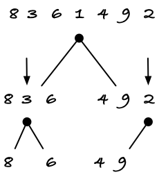

Split again after that.

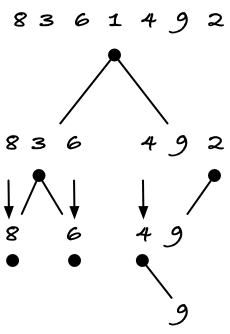

And when you are all the way down, you have your Cartesian tree.

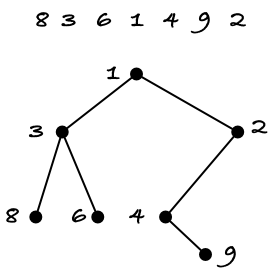

The Cartesian tree relates to RMQ in a quite simple way. Whenever you want $\mathrm{RMQ}(i,j)$, you pick the highest node in that range.

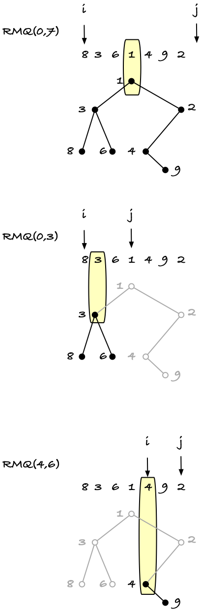

We are not going to *use* Cartesian trees for RMQ. We would have to search down to find the right range of values and such if we did (and of course you can if you want to), but this relationship between RMQ and Cartesian trees is interesting for us. If the topology of a Cartesian tree determines the result of all RMQ on the array--and it does if we always just pick the highest node--then the number of essentially different blocks is bounded by the number of Cartesian tree topologies. There may be an infinite number of possible blocks--it is arrays of integers, and there are certainly an infinite number of those--but there are not an infinite number of Cartesian tree topologies for arrays of a fixed size $b$.

To see that the number of topologies is bounded by $O(2^{2b})$, and to get an algorithm for mapping a block to a number in the range $[0,2^{2b})$ that we can use for indexing into a table, we will look at a linear time algorithm for building Cartesian trees.[^5]

The algorithm resembles the algorithm for building a suffix tree from a suffix array that we see in GSA. We scan along an array and build the tree left-to-right by searching up along the right-most edge of the current tree to find where we should insert the next node. It is just a little simpler than that algorithm.

You start by adding the first element in the array to a tree. Usually, the algorithm is describes as just adding that node, but I find that implementing the algorithm is easier if you have a dummy node with value $-\infty$ as a root. We are going to search up as long as we have a value smaller than the node we are currently looking at, and that dummy element saves us from dealing with special cases when we move beyond the root.

Anyway, create a tree with a dummy $0\infty$ node and then put the first element below it.

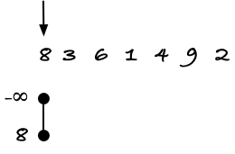

Now, go to the next value in the array, and in your tree you search up up in tree until you sit on an edge between a value that is smaller than the current one and one that is larger. (This is where the dummy value is useful). In the example array we have used, the second element is 3, so we would search past the first element, with value 8. 

On that edge, create a new node, and take the tree you moved past (in this case just a single node) and make it the left child of the new node.

Now you should have the tree shown below. The nodes $-\infty$ and 3 are shown in black while the node we moved to the left child of 3 is shown in white. This is to distinguish between the right edge of the tree, the black nodes, and the part of the tree we have put in a left child of a node. The latter we will never see again, while the former are nodes we might have to search through to find the next place to put a node.

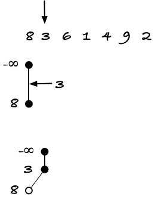

The next value in the array is 6. Since six is greater than the rightmost node, 3, we are cannot search up to find an edge to put it on, but it will instead go to the right of 3. We don't move any nodes to a left tree because we do not move up the right edge of the tree, but we extend the right edge so it now consists of nodes, top to bottom, $-\infty$, 3, and 6.

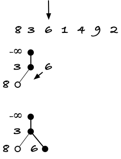

For the next value, 1, we must search up past node 6 and 3 to find an edge where we can place the new node. We put the 1 node there, and the nodes we moved past go into its left sub-tree. Now, these are alsso shown in white, because they are no longer part of the tree's right edge; they sit in the left child of a node instead.

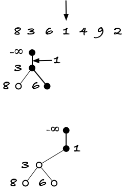

Value 4 is greater than 1, so we don't move up the tree and just put a 4 leaf as the rightmost child in the tree.

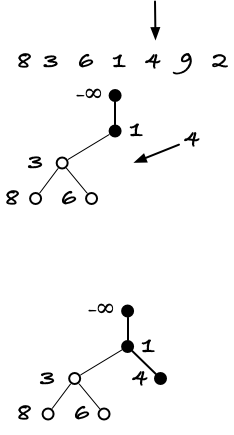

With value 9, we do the same. Now the right edge of the tree is $-infty$, 1, 4, and 9 (while 8, 3, and 6 are sitting in the left tree of node 1).

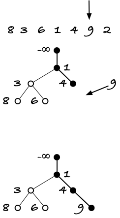

When we get to the final value, 2, we search up the tree until we get to the edge between 1 and 4. That is where the value 2 belongs, so we insert a node there. The values we searched past, 4 and 9, become the left child of node 2.

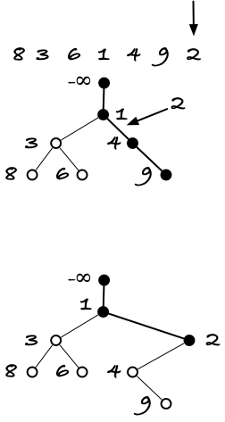

Notice that when we move a tree on the right edge to left child of a new node we preserve the topology. When we constructed the sub-tree for 4 and 9 we added 9 as a right child of 4, and it remains a right child of 4 when we move the tree to the left child of node 2.


Now I want you to think of the operations we did as stack operations. This makes the time analysis simpler (and is also the easiest way to implement the tree construction when you implement it). The right edge of the current tree is the stack. We start with a stack that contains $-\infty$ and our first operation is to *push* the first element in the array. That makes the first value the *top* of the stack and $-\infty$ the bottom. (Read the tree as an upside-down stack on the figures).

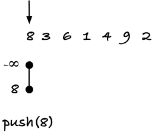

Then when we see the next value in the array, we *pop* elements as long as the *top* is greater than the current value. When we see the value 3 we will *pop* 8, because it is greater than 3, and then we will stop because the new *top* is $-\infty < 3$. Once you are done *popping*, you *push* the new value onto the stack (with the popped elements as its left child).

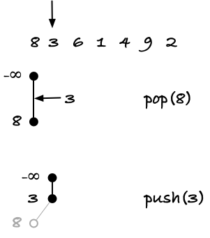

For the value 6, we cannot pop anything (the top 3 is less than 6) so we just push it.

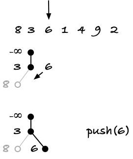

For the value 1 we pop 6 and 3 and then we can't pop $-\infty$ so we stop there and push 1.

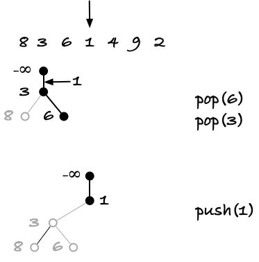

For falues 4 and 9 we can't pop anything but we can push the values.

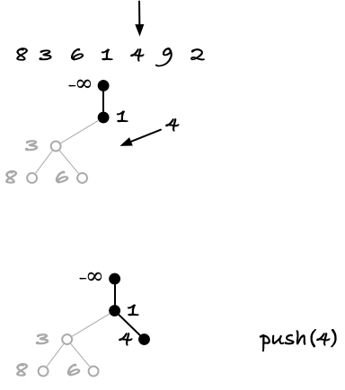

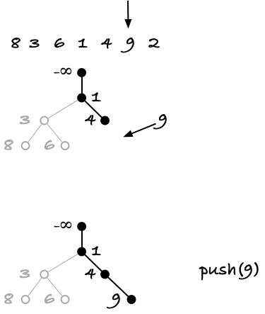

Finally, when we get to 2, we pop 9 and 4 and then push 2.

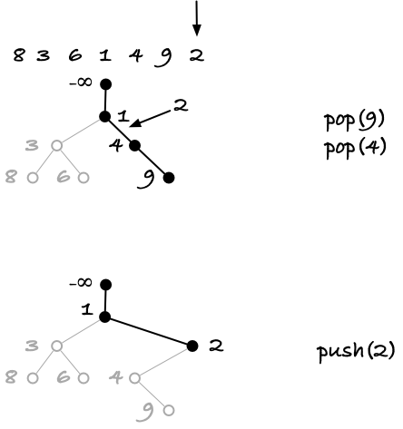

When you consider the algorithm as operations on a stack, you immidiately get a linear running time. We push each value exactly once, so we have $b$ pushes. The number of pops varies, but we obviously cannot pop more elements than we push, so it is boundec by $b$. That tells us that the maximum number of operations is $2b$.

Moreover, and this is where we get our bound on the number of different Cartesian trees and thus different RMQ block types, the stack operations and their order completely determines the Cartesian tree we are building. If someone gives us a valid sequence of push and pop instructions, we can construct the tree witout knowing anything about the values in the array we are building the tree over.

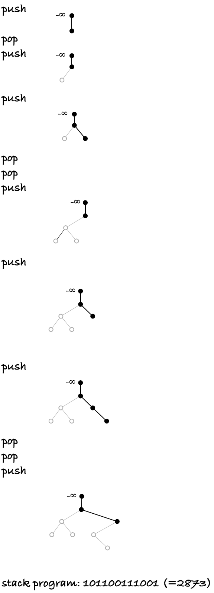

There are only two operations, push and pop, so we can encode those as bits, 1 for push and 0 for pop, for example, and that maps any tree construction program to a $2b$-bit integer.

We don't need to build the trees for mapping blocks to unique types. The gray'ed out parts of the trees in the figure above are a consequence of the algorithm, but they do not add any information about the tree. A stack that just contains the values from the array will work just as well for determing how much you should pop between each push.

### Linear time preprocessing

So what we can do to map blocks to unique tables is now simple: run this construction algorithm to determine the push and pop operations, encode them as a $2b$-bit binary integer, and use that to map into a table of RMQ-tables. There are $n/b$ blocks and you can map in $O(b)$, so mapping blocks to tables take $O(n)$.

Then, for each of the $2^{2b}$ tables, use the simple dynamic programming algorithm from far above to build the block-table in $b^2$ in total time $2^{2b}b^2 = \left(n^{1/k}\log n\right)^2 \in o(n)$ when $k\geq 4$.

The bound $2^{2b}$ for the number of block types is a little pessimistic, of course. We are putting exactly $b$ 1-bits into a $2b$-bit word, so a better upper bound is $2b \choose b$, which is substantially less (see figure below where the y-axis is log-scaled). It is actually even better than this; a result from combinatorics is that the number of topologies for binary trees with $b$ nodes is bounded by the $b$'th [Catalan number](https://en.wikipedia.org/wiki/Catalan_number) $C_b = \frac{1}{b+1}{2b \choose b}$.

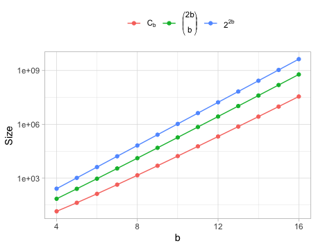

This is only good new for our running time. The first upper bound, $2^{2b}$, gave us a linear time preprocessing, so if we have to process substantially less than that many tables we have an even faster algorithm. It also means, however, that if we build a table of size $2^{2b}$ for our block tables we will be wasting memory on empty entries, and the fraction we actually use decreases rapidly as $b$ increases.

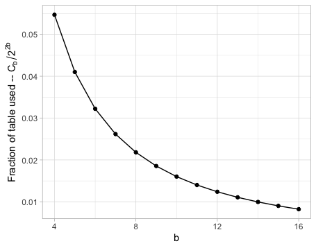

To put this into concrete numbers, let's assume that $n$ fits into a 32-bit number, and let's simplify that as $n=2^{32}$. That means $\log_2 n = 32$ and $b = 1/4 \log_2 n = 8$. If we use a table of size $2^{2b}=2^{16}$ its size is 65,536. For the same $b$, $2b \choose b$ is only 12,870 and the 8'th Catalan number is only $\frac{1}{8+1}{16 \choose 8} = 12,870 / 9 = 1,430$, or about two percent of the table actualy used.

We do have linear preprocessing at this point, so all is good in that sense, but it is just wasting a lot of memory if we map blocks to $2b$-bit numbers and use an array to store tables. (A better representation of the table, such as a hash table, might alleviate this, but with some overhead). We can, however, improve on the idea and get a mapping from blocks to $\{0,1,\ldots,C_b-1\}$ thus wasting no memory if all blocks are present. It just requires a slight twist to the idea we already have. The twise requires some more math, but the implementation is as simple as if we had stopped here.

### Ballot numbers and paths in the "ballot grid"


The *Ballot numbers* $B_{pq}$[^6] are defined as $B_{00} = 1$ and $B_{pq} = B_{(p-1)q} + B_{p(q-1)}$ when $0 \leq p \leq q \neq 0$ and $B_{pq} = 0$ otherwise. You can think of them as sitting in a grid, where $B_{pq}$ is the sum of the number immidiately to its left, $B_{(p-1)q}$, and immidiately above it, $B_{p(q-1)}$.

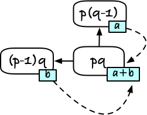

We usually don't draw the zero-valued numbers, so if we were to draw the ballot numbers up to $B_{44}$ we would draw something like this:

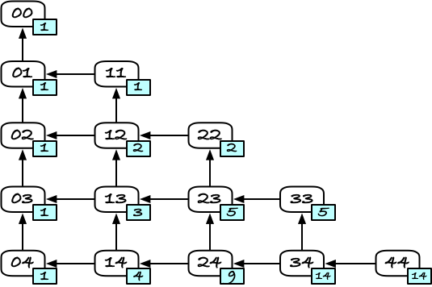

If you don't want to compute the value of $B_{pq}$ recursively, a result from combinatorics is that $B_{pq} = \frac{q-p+1}{q+1}{p+q \choose p}$.

There are two properties that make these new numbers interesting to us when we want to map Cartesian trees to numbers. The first is how they relate to the Catalan numbers, and thus to how many different topologies we can have for a tree with $b$ nodes. If you take the analytical formula for $B_{pq}$ and set $p=q=b$ you get $B_{bb} = \frac{b-b+1}{b+1}{b+b \choose b} = \frac{1}{b+1}{2b \choose b} = C_b$. Thus, when $p=q$, we have a Catalan number. The second property is that $B_{pq}$ is the number of paths you have from $B_{pq}$ to $B_{00}$ in the grid we just drew. To see this, consider that you have to go through $B_{(p-1)q}$ or $B_{p(q-1)}$ when you are leaving $B_{pq}$, and the number of paths you from there are the values of those two numbers.

If we look at the grid that goes from $B_{bb}$ to $B_{00}$ to $B_{bb}$, the total number of paths from $B_{bb}$ to $B_{00}$ is thus exactly the number of binary trees we can have with $b$ leaves. If we can match each tree topology to a path in this grid, and each path in the grid to a number in $\{0,\ldots,C_b-1\}$, then we have the mapping we so much desire.

Mapping trees to paths is the easy part. We can basically reuse the idea we already have, with simulating constructing Cartesian trees with a stack. Instead of generating a binary number, however, we can consider the push and pop operations as directions to follow in the grid.

First, though, I'll flip the grid both horisontally and vertically because I find it easier to read left-to-right and top-down. It's a cultural thing.


When we trace a path through the grid, we start in $B_{bb}$ and move towards $B_{00}$. Whenever you push to the stack in the previous algorithm, move right, and whenever you pop, move down.

As an example, consider the array `[8, 3, 6, 1]`. In the figures below, the arrow at the top shows where we are in processing the array--initially we are to the left of the first element--the arrow pointing to a node in the grid shows where we imagine that we are there, and the stack does its stack thing.

We start with $-\infty$ on the stack and in the $B_{44}$ node.

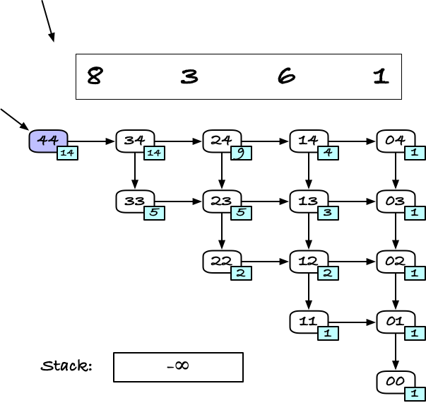

The first step is always a push, because we can't pop $-\infty$. That moves us one step to the right in the grid.


The next value we see, 3, is less than 8, so we need to pop 8 off the stack and push 3 onto the stack. That takes us one node down with the pop and one node right with the push.

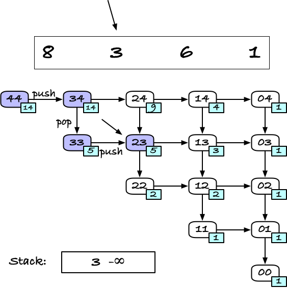

When we then see 6, we can't pop 3, so we just push, moving us one node to the right in the grid.

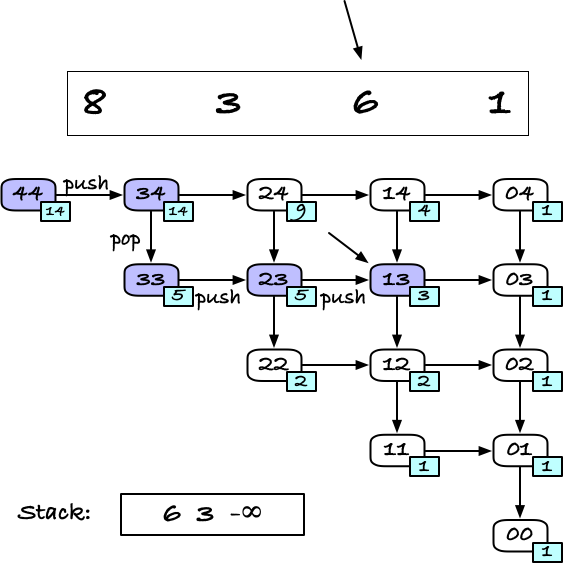

Finally, when we get to 1, we must pop both 6 and 3, moving us two nodes down, and then push 1, moving us right to the rightmost column.

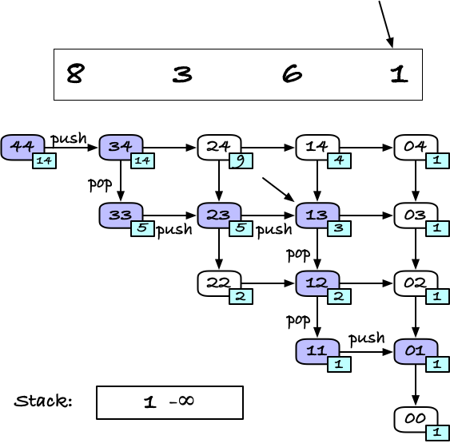

We are not yet at $B_{00}$, but just as we didn't care popping any remaining elements off the stack earlier, once we made it through the array, there isn't any need to continue to $B_{00}$. Once we make it to the rightmost column, there is only one possible path to $B_{00}$, we can just implicitly pretend that we take it.

The grid nicely matches how our stack works. You have to push before you can pop, and in the grid you have to move right before you can move down, and you cannot move further down than you have moved right.

All runs of the stack algorithm will take us $b$ steps to the right, after which the final part of the path is fixed, so running the Cartesian tree construction algorithm will always give us a corresponding path in the grid, and different trees will give us different paths. We have a mapping from block types (via Cartesian trees) to paths in the Ballot number graph.

To assign a unique number to each path, we will do something that might look odd at first. We will put a weight on the "push" edges, those going downwards. The weight at the rightmost column, that we don't really care about, can be zero if you want, or you can just ignore those. The number we assign a path is the sum of the edge weights it passes through, and the weight we put at an edge is the number in the node the edge *doesn't* lead to. That is, The edge $B_{pq} \to B_{p(q-1)}$ gets the weight $B_{(p-1)q}$.

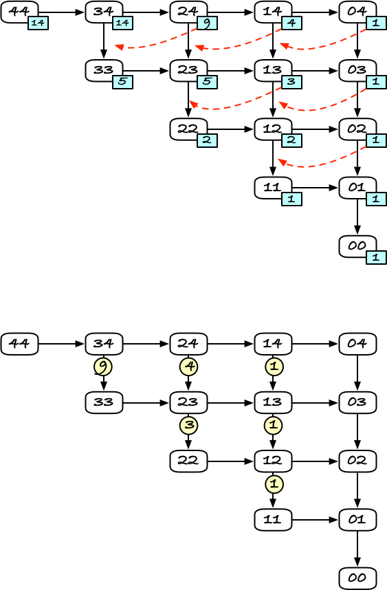

It does look weird, but this is why. If you are at a given node, say $B_{34}$ and you go down instead of right, you want the count from that point on to start after all the numbers you have assigned if you went right instead. The value to your right is exactly how many paths there are to the right, so if you start counting from that point, by adding this particular weight to the path, the paths that go right can be counted below that number.

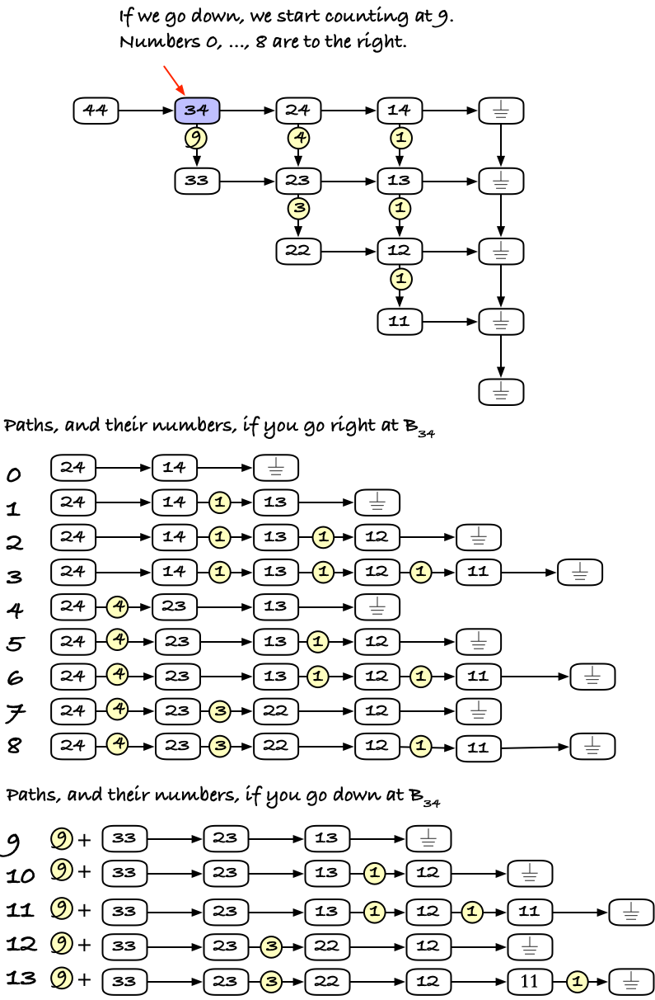

In other words, by adding the total number of paths on the right, we reserve numbers from those, and we can count from the next value as we continue.

I realise that there are a lot of ideas in play at this point--Cartesian trees that capture the structure of RMQ queries, stack machines that encode Cartesian trees, and now paths in Ballot number grids. It is a lot to wrap your head around. The good news is that, overwhelming as it seems, it is not terribly more complicated to implement this than the structures we have already seen implementations of.

Building the block tables is rather simple. We can tabulate all the Ballot numbers we need in $O(b^2)$ which we have plenty of time for:

```rust
/// Build a table of Ballot numbers B_pq from p=q=0 to p=q=b.
fn tabulate_ballot_numbers(b: usize) -> matrix::Matrix {
    let mut ballot = matrix::Matrix::new(b + 1);
    for q in 0..=b {
        ballot[(0, q)] = 1
    }
    for q in 1..=b {
        for p in 1..=q {
            ballot[(p, q)] = ballot[(p - 1, q)] + ballot[(p, q - 1)]
        }
    }
    ballot
}
```

Then computing the block type number is just running the stack algorithm:

```rust
/// Compute the block type number of a block.
/// The b argument is the true block size, but it can differ from block.len() for the last
/// block. When we process the last block, we fake push the missing elements, putting them
/// lower in the Cartesian tree than the real ones, so we still get the right RMQ.
fn block_type(block: &[usize], b: usize, stack: &mut [i64], ballot: &matrix::Matrix) -> usize {
    let mut num = 0;
    let mut top = 0;
    stack[top] = i64::MIN; // As close to -infinity as we get with this type...

    for (i, &v) in block.iter().enumerate() {
        let signed_v = v as i64;

        // Invariant: When i runs from zero to b, b-i is p in B[p,q].
        //            i-top is how the depth of the stack and b-(i-top)
        //            is then the q in B[p,q].
        let p = b - i;
        while stack[top] > signed_v {
            // Popping
            let q = b - (i - top);
            num += ballot[(p - 1, q)];
            top -= 1;
        }

        // Push...
        top += 1;
        stack[top] = signed_v;
    }

    return num;
}
```

I switch to signed numbers for the stack so I can use the smallest 64-bit integer as minus infinity. If I started from scratch instead of building the algorithms in sequence, I might have thought more about the appropriate type to begin with, but I didn't.

To look up the correct Ballot number when I need to add an edge weight I explit that the index into the block moves from 0 to $b-1$ and which is the reverse of the move in $p$ coordinates in the grid, so $p = b - i$. The $q$ coordiate is how many times I have popped, which I don't have, but I know how deep the stack is (the `top` variable) and I know how many times I've pushed (the `i` index), so I have $q=b-(i-\mathrm{top})$.

To get all block types and tables, we run through the blocks and compute the number, if we hit a new number, i.e. if the table of tables doesn't already have a table for that number, we build the table the way we did with the simple $O(n^2)$ algorithm:

```rust
/// Compute the block types for all blocks in x and compute the tables for the
/// blocks we observe.
fn tabulate_blocks(x: &[usize], b: usize) -> (Vec<usize>, Vec<Option<tabulate::TabulatedQuery>>) {
    // We need to round up to get the number of blocks here.
    // The reduced array handles blocks 0, 1, ..., x.len()/b but we
    // might also have a block after it.
    let no_blocks = (x.len() + b - 1) / b;

    let ballot = tabulate_ballot_numbers(b);
    let mut stack: Vec<i64> = vec![i64::MIN; b + 1];

    let mut block_types = vec![0; no_blocks];
    let mut block_tables = vec![None; ballot[(b, b)]];
    for i in 0..no_blocks {
        let begin = i * b;
        // The last block might be smaller than a full block, but if we just
        // tabulate it anyway the missing values are virtually pushed and behave
        // like they are larger than the existing ones, giving us the right RMQ
        // results anyway (the true values are always smaller than the virtual ones).
        let end = cmp::min(x.len(), begin + b);
        let block = &x[begin..end];

        let bt = block_type(block, b, &mut stack, &ballot);
        block_types[i] = bt;
        if let None = block_tables[bt] {
            block_tables[bt] = Some(tabulate::TabulatedQuery::new(block));
        }
    }
    return (block_types, block_tables);
}
```

The data structure we need need for this preprocessed table looks much like the reduced table we had earlier, we just have to add the vectors of block types and block types, and I won't list it here (but you can see it in the code in `rmq/rmq/src/optimal.rs`). Nor will I list all the code for using it. The interesting bits are the code for looking up a query $[i,j)$ where both $i$ and $j$ are in the same block. There, we need to get the correct block and there perform the query, where we have adjusted the indices so they are relative to the beginning of the block. When we have performed the query, we need to adjust the result in the other direction, translating it back from an offset into the block to its index in the full data.

In my implementation, I first check if the interval I am looking at is valid (`i < j`) since I can return `None` immidiately if it isn't. The block tables will also handle it, but there is no need to go through all the book keeping if the result will be `None` anyway. In addition, it handles the special case where we look at the range $[n,n)$ which occurs when $j$ points to the end of the array and $n$ is a multiple of the block size. Here, we would either have to put a table for an empty block, or we would have to explicitly return `None` anyway.

```rust
fn block_rmq(&self, i: usize, j: usize) -> Option<Point> {
    if i < j {
        // Get misc values and tables we need...
        let BlockSize(bs) = self.block_size();
        let block_index = i / bs; // The index in the list of blocks
        let block_begin = block_index * bs; // The index the block starts at in x
        let block_types = self.0.borrow_block_types();
        let block_tables = self.0.borrow_block_tables();
        // Get the table for this block by looking up the block type and then the
        // table from the block type.
        let tbl = block_tables[block_types[block_index]].as_ref().unwrap();
        // Get RMQ and adjust the index back up, so it is relative to the start of the block.
        let rmq_idx = Some(tbl.rmq(i - block_begin, j - block_begin)? + block_begin);
        Point::get(rmq_idx, self.x())
    } else {
        // j <= i so not a valid interval.
        None
    }
}
```

Finally, we need to implement the actual RMQ operation. This one looks much like the earlier "reduced" solution. We first get the block indices for the range. Here, we always want to round down to get the indices for the block tables, but for the reduced part, we need to round up for `i` to get the first block the reduced table handles. So we get two block indices for $i$. For $j$, both tables round down, so we don't need an extra index there. The `round_up()` and `round_down()` functions we used for the reduced solution give us indices for the other ends of the blocks where $i$ and $j$ sits, just as before, and just as we used these for a linear scan earlier, we can now use them to look up RMQ in the corresponding blocks.

```rust
impl<'a> RMQ for Optimal<'a> {
    fn rmq(&self, i: usize, j: usize) -> Option<usize> {
        let BlockSize(bs) = self.block_size();
        // The block indices are not the same for the small tables and the
        // sparse table. For the sparse table we have to round up for i, but
        // to get the block i is in, we need to round down.
        let bi = BlockIdx(i / bs);
        let (sparse_bi, ii) = round_up(i, BlockSize(bs));
        let (bj, jj) = round_down(j, BlockSize(bs));

        if bi < bj {
            let p1 = self.block_rmq(i, ii);
            let p2 = Point::get(self.sparse_rmq(sparse_bi, bj), self.x());
            let p3 = self.block_rmq(jj, j);
            let min = super::lift_op(cmp::min);
            Some(min(min(p1, p2), p3)?.0)
        } else {
            Some(self.block_rmq(i, j)?.0)
        }
    }
}
```


[^1]: You can't always get constant time lookup with the sparse table trick, but then you can often get query times that are proportional to the size of the blocks, so that would be `O(log n)` here. This is not a bad query time; it only looks like it because we can do better her.

[^2]: Self-referencing means that the data structure has references to something it holds itself. In our case, the sparce table has a reference to the reduced values, and the reduced values are held by the structure. This is sometimes useful, but it makes memory checkers work harder than they care to, and Rust's type checker doesn't like it. It is possible, but not pretty.

[^3]: It is called "lift_op" [because of reasons](https://en.wikipedia.org/wiki/Lift_(mathematics)), but it just means that I translate some function `f: A -> B` into another `lift(f): F(A) -> F(B)` where `F(X)` is some type that depends on `X`. The general stuff is terribly abstract, so ask a hard-core mathematician about that, but in our case we have a type `T` where we have an operation `f: (T,T) -> T` but we need one that works on `(Option<T>,Option<T>) -> Option<T>` and the `lift_op` does that with the rules in the `match (a, b) { ... }` expression. It is more complicated than usual, because usually we would say that `lift(f)` should return `None` if either argument is `None` and only apply `f` if both were `Some(...)` and in that case the function body could be `move |a, b| Some(f(a?,b?))`.

[^4]: It is not the only question, of course, you could also ask if there is a completely different approach to get there, but I don't know any such approaches, so I will pretend that you asked the first question.

[^5]: The algorithm where we split an array at the smallest value and the recursively construct the tree for the left and right array runs in $O(b)$ if the array is $b$ long, because we need to locate the smallest element in each recursive call. The linear time algorithm avoids this.

[^6]: I use the notation $B_{pq}$ rather than $C_{pq}$ used in the literature to distinguish ballot numbers from Catalan numbers--although the two are intimately related, as we shall see.